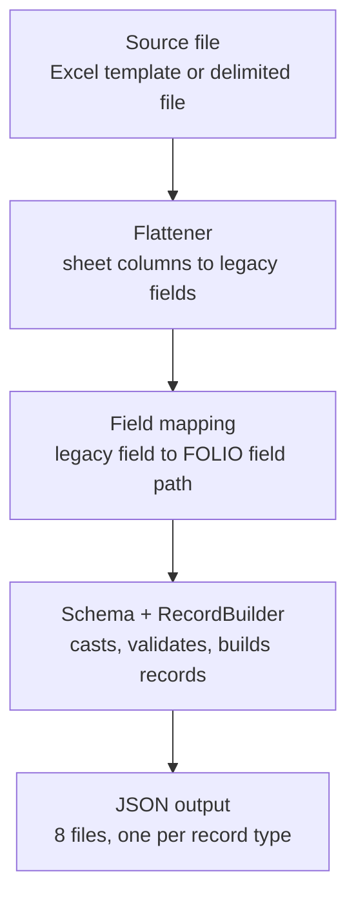
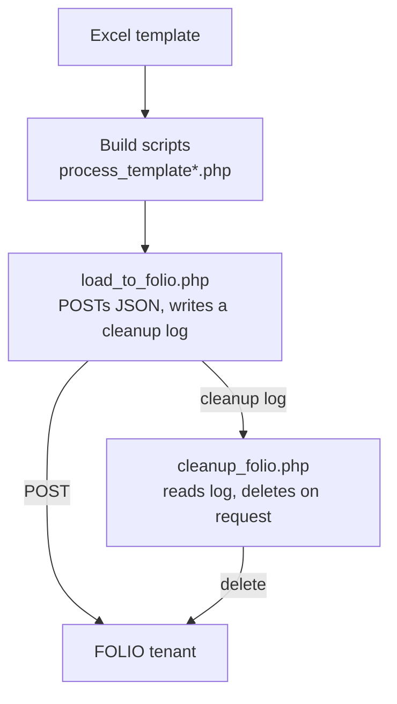

# CLAUDE.md

This file provides guidance to Claude Code (claude.ai/code) when working with code in this repository.

## Commands

```bash
composer install                                    # install dependencies (resolves marnold-ebsco/phpfolioclient via a vcs repo in composer.json)
vendor/bin/phpunit                                   # run the full test suite
vendor/bin/phpunit tests/TemplateFlattenerTest.php    # run one test file
vendor/bin/phpunit --filter testMethodName            # run one test by name (substring/regex match)
vendor/bin/phpunit --filter ClassNameTest             # run one test class
```

No lint or static-analysis tooling is configured (no phpstan/psalm/php-cs-fixer, no composer scripts) — `php -l <file>` is the only syntax check available.

Entry points (each takes `--help` for its full option list):

```bash
php process_template.php --input=Organization_Template_filled.xlsx --output-dir=output/
php process_template_alt.php --input=Organization_Template_Alternate_filled.xlsx --output-dir=output_alt/
php bin/build-organizations --input=orgs.tsv --mapping=organization_field_mapping.json --output=output/organizations.json
php load_to_folio.php --folio-config=folio.ini --input-dir=output/ --dry-run
php cleanup_folio.php --log=logs/some_cleanup.log --folio-config=folio.ini
```

`folio.ini` (FolioConfig: `okapiUrl`, `tenant_id`, `username`, `password`) is never committed — `*.ini` is gitignored. Never create or commit one; if a task needs to talk to a real FOLIO tenant, ask the user for the config path/credentials rather than assuming one exists.

## Architecture

This builds FOLIO mod-organizations-storage (and mod-notes) JSON from legacy organization data, then optionally loads it into a live tenant. Building/validating and loading are deliberately separate scripts with no shared state beyond the JSON files on disk.

### The four-layer build pipeline

A filled-out workbook (or delimited file) becomes JSON through four layers, each aware only of the one next to it — nothing cross-checks all four, so a mismatch between any two fails silently (a field just never populates) rather than erroring:



1. **The source file** — either of two independent Excel templates (`Organization_Template.xlsx` / `Organization_Template_Alternate.xlsx`), or an arbitrary delimited file for `bin/build-organizations` directly.
2. **A flattener** (`src/TemplateFlattener.php` / `src/AlternateTemplateFlattener.php`) — reads specific sheet names/columns by exact string and writes a flat, one-row-per-organization array keyed by **legacy field** names (`address_city`, `contact2_firstName`, `note1_type`, ...). `process_template.php`/`process_template_alt.php` are thin CLI wrappers around these, writing the flattened rows to a temp delimited file and handing off to `bin/build-organizations`.
3. **`organization_field_mapping.json`** (`src/Mapping/FieldMapper.php`) — maps each legacy field key to a **FOLIO field** path (`addresses.city`, `contacts[2].firstName`, `notes[1].typeId`) using bracket notation for repeatable groups (`addresses.city` is shorthand for `addresses[1].city`). This file, not the flatteners, controls how many instances of a repeatable group get built.
4. **A schema class** (`src/Schema/*.php`) — static data only (`SCALAR_FIELDS`, `LIST_FIELDS`, `NESTED_GROUPS`, `REQUIRED_FIELDS`, enums/patterns). `src/RecordBuilder.php` reads these constants to actually cast, validate, and assemble each record from a mapped row.

Both templates share the same mapping file and schema classes — only the flattener differs. See `TEMPLATE_README.md` for the full recipe book on adding/removing columns or sheets and keeping all four layers in sync; `README.md` and `README_alternate.md` are separate, deliberately non-cross-referencing user guides (the alternate template's docs were rewritten to stand entirely on their own, since the original template is expected to be deprecated eventually).

`bin/build-organizations` is the actual class-based CLI (declared as the Composer `bin`); `build_organizations.php` at the repo root is an older, procedural predecessor kept in place but no longer referenced by any documentation — don't confuse the two.

### Deterministic ids, not random ones

Every generated id (`ReferenceRegistry::resolve()`/`generateUuidV5()`, and `computeDeterministicId()` in `bin/build-organizations`) is a `uuid5` of FOLIO's own well-known namespace plus a `tenant:objectType:legacyId` (or `:name`) string — the same convention the real `folio_uuid` Python migration-tooling library uses. This means: re-running the same input reproduces identical ids, categories/organization-types/note-types with the same name always hash to the same id (dedup for free), and organizations built from either template hash to the same id for the same name+code — a useful sanity check when changing a flattener (both templates' example data should always build byte-for-byte identical output).

### Standalone records vs. nested groups

Addresses/phones/emails/urls/aliases/accounts are nested arrays *inside* the organization object. Contacts, interfaces (+ their credentials), and notes are **not** — each becomes its own top-level record in its own output file, and an organization's own `contacts`/`interfaces` arrays are auto-populated with the ids of records built from that same row (`bin/build-organizations`, after `RecordBuilder::build()` returns — this cross-linking can't happen inside `RecordBuilder` itself, which builds one record at a time with no visibility into siblings). A note additionally requires its organization to have been *accepted*; a rejected organization's contacts/interfaces still build regardless (see either README's "rejected organization" section).

Notes belong to mod-notes, a completely different FOLIO module from mod-organizations-storage (`src/Schema/NoteSchema.php`); `domain`/`links` are assigned programmatically in `bin/build-organizations`, not mapped from any column.

### Loading and cleanup



`load_to_folio.php` POSTs the 8 output files in a fixed, dependency-respecting order (see its own docblock's `PHASES` constant) and is not idempotent. `/note-types` (and, it turns out, `/notes`) has been confirmed against a live tenant to sometimes ignore the client-supplied id entirely, or return a 500 while creating the record anyway — `load_to_folio.php` detects and recovers from both (`findExistingNoteTypeIdByName()`/`findExistingNoteId()`), and writes every record's *real* id to a separate cleanup log grouped by endpoint. `cleanup_folio.php` reads that log back (never the ids in the original output files, which may not match what the tenant actually assigned) and deletes in the reverse order, with a mandatory preview + confirmation before doing anything.

### Testing

Only `src/` classes have unit tests. `bin/build-organizations`, `process_template*.php`, `load_to_folio.php`, and `cleanup_folio.php` all end in an unconditional `exit(main($argv))`, so they can't be `require`d from a test without terminating the process — they're verified by actually running them (against `tests/fixtures/*.xlsx` for the flatteners, or a disposable mock Okapi server built with PHP's built-in `php -S` for the two FOLIO-talking scripts) rather than through PHPUnit.
